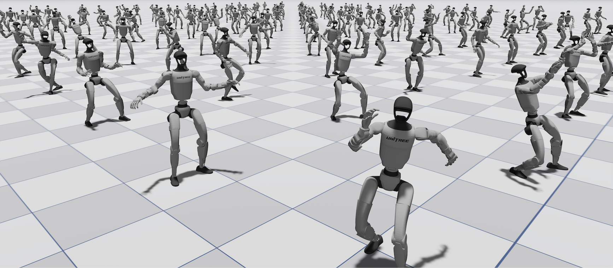

# UniLab

Languages: English | [简体中文](docs/users/zh_CN/01-getting-started.md)

Train robot RL without a GPU simulation backend.

UniLab uses **CPU simulation + shared-memory runtime + GPU learning** instead of coupling simulation and learning inside one GPU-resident pipeline.

Start with the `Quick Demo` below to run the primary training command from this repository.

## 🚀 Quick Demo

```bash
# 0. If uv is not installed
curl -LsSf https://astral.sh/uv/install.sh | sh

# 1. Clone the repository
git clone https://github.com/unilabsim/UniLab.git
cd UniLab

# 2. Install dependencies
uv sync --extra motrix

# 3. Run a first PPO training job
# macOS: 73s on M5Max-128GB, 1min43s on M3Max-48GB, 2.5min on MacBookNeo-8GB
# Linux: 31s on RTX 4090 and R9-9950x3d
uv run train --algo ppo --task go2_joystick_flat --sim motrix
```

This is the first-level training entrypoint. It routes to the registered `go2_joystick_flat/motrix` task owner config and keeps backend selection in the CLI flags.

For evaluation and demo playback:

```bash
uv run eval --algo ppo --task go2_joystick_flat --sim motrix --load-run -1

# Demo playback from a local trained checkpoint
uv run demo
```

On macOS / MacBook, the UniLab CLI routes Motrix renderer playback through `mxpython` when needed. Detailed script-level commands are documented under `docs/users/zh_CN/`.

### Interactive Notebooks

Prefer a guided, step-by-step experience? Open the notebooks in Jupyter:

- [Demo Notebook](notebook/demo.ipynb): local checkpoint playback via `uv run demo`
- [PPO Training Walkthrough](notebook/unilab_walkthrough_ppo_go1_joystick_mujoco.ipynb): end-to-end guide from config preview to training to playback, with explanations for beginners

> Notebooks require a local environment (no Colab support) — MuJoCo needs local compute.

## 🏃 Example Runs

These are example repository runs for documented commands and hardware setups. They are useful as concrete entrypoints and reported timings, but they are **not** yet a formal benchmark manifest.

```bash
# Linux SAC (5.5min on RTX 4090 and R9-9950x3d)
uv run train --algo sac --task g1_walk_flat --sim mujoco
```

```bash
# Linux G1 motion tracking (1h35min on RTX 4090 and R9-9950x3d)
uv run train --algo ppo --task g1_motion_tracking --sim mujoco
```

## 🧱 System Layout

```
┌───────────────────┐     Unified Shared Memory     ┌────────────────────┐
│  CPU Physics Sim  │ ───────────────────────────▶  │ GPU Policy Training│
│  mujoco.rollout   │      SharedReplayBuffer       │   PPO / SAC / TD3  │
│ Multithread Step  │    (PyTorch shared tensors)   │     CUDA / MPS     │
└───────────────────┘                               └────────────────────┘
```

## 🎯 Training Entrypoints

Use `uv run train` for training, `uv run eval` for checkpoint playback, and `uv run demo` for the local demo preset. These commands wrap the lower-level training scripts while keeping task and backend selection explicit.

| Goal | Primary command | Log root pattern |
|------|------------|------------------|
| PPO (torch / RSL-RL) | `uv run train --algo ppo --task <task> --sim <backend>` | `logs/rsl_rl_ppo/<task>/` |
| PPO (MLX, macOS) | `uv run train --algo mlx_ppo --task <task> --sim <backend>` | `logs/mlx_rl_train/<task>/` |
| APPO | `uv run train --algo appo --task <task> --sim <backend>` | `logs/appo/<task>/` |
| SAC | `uv run train --algo sac --task <task> --sim <backend>` | `logs/fast_sac/<task>/` |
| FlashSAC | `uv run train --algo flashsac --task <task> --sim <backend>` | `logs/flash_sac/<task>/` |
| TD3 | `uv run train --algo td3 --task <task> --sim <backend>` | `logs/fast_td3/<task>/` |

Training commands automatically enter playback after training unless you set `training.no_play=true`.

Direct script entrypoints are kept in the user documentation under `docs/users/zh_CN/`.

Supported algorithms: `ppo`, `mlx_ppo`, `appo`, `sac`, `td3`, `flashsac`
Supported simulators: `mujoco`, `motrix`

Hydra overrides can be appended directly:

```bash
uv run train --algo ppo --task go2_joystick_flat --sim mujoco training.max_iterations=10
```

### Demo

`uv run demo` runs a pre-configured playback using a checkpoint already present in the local training output.

| Flag | Description |
|------|-------------|
| `--preset` | Demo preset name (default: `go2_joystick_mujoco_ppo`) |
| `--refresh` | Remove and regenerate the demo directory |
| `--device` | Inference device (`cpu`, `cuda`, `mps`) |

> **For Developers**: Demo checkpoints currently require local training output. A checkpoint hosting solution (CDN / model registry) with automatic download is not yet in place.

## 🐳 Docker

Use Docker when you want an isolated Linux runtime without changing your local Python environment. Local development still works best with `uv sync`; Docker is mainly for clean environment setup, image validation, and containerized runs.

### Build Image

```bash
docker build -t unilab:latest .
```

The image installs the default UniLab runtime, `mujoco-uni`, the `motrix` extra, and the dev/test tools.

### Run Image

```bash
# Check the unified CLI entrypoint
docker run --rm unilab:latest

# Interactive development with the repo mounted
# Keep .venv in a named volume so the container does not overwrite the host venv
docker run --rm -it \
  -v "$(pwd):/workspace/UniLab" \
  -v unilab-venv:/workspace/UniLab/.venv \
  -w /workspace/UniLab \
  unilab:latest bash
```

Using a named volume for `/workspace/UniLab/.venv` avoids mixing a container-created virtual environment with the host checkout. This prevents path mismatches such as `/workspace/UniLab/.venv` vs `.venv` and avoids permission problems when returning to local `uv` or `make test-all` workflows.

### GPU Containers

On Linux hosts with the NVIDIA Container Toolkit configured, you can pass `--gpus all` to expose CUDA inside the container. See [01 Getting Started](docs/users/zh_CN/01-getting-started.md) for detailed container verification commands.

## 🗺️ Repository Map

- `conf/`: Hydra configuration, including task / reward / algorithm composition
- `scripts/`: direct entrypoints for training, playback, motion preprocessing, and tooling
- `src/unilab/`: environments, backends, algorithms, and shared utilities
- `tests/`: unit tests, integration tests, and script configuration tests
- `docs/`: user documentation under `docs/users/` and developer documentation under `docs/developers/`

## 📚 Documentation

### For Users
- [01 Getting Started](docs/users/zh_CN/01-getting-started.md): installation, dependency setup, mirrors, and first-run commands
- [02 Simulation Backends](docs/users/zh_CN/02-simulation-backends.md): MuJoCo / Motrix support scope and backend selection
- [03 Training Guide](docs/users/zh_CN/03-training.md): training, playback, resume flow, Hydra overrides, and W&B
- [04 Algorithms](docs/users/zh_CN/04-algorithms.md): APPO, FastSAC, and FastTD3 usage and differences
- [05 G1 Motion Tracking](docs/users/zh_CN/05-motion-tracking.md): the G1 whole-body motion-tracking task
- [06 Domain Randomization](docs/users/zh_CN/06-domain-randomization.md): domain randomization configuration and best practices
- [Demo Notebook](notebook/demo.ipynb): local checkpoint playback via `uv run demo`
- [PPO Training Walkthrough](notebook/unilab_walkthrough_ppo_go1_joystick_mujoco.ipynb): beginner-friendly end-to-end training guide


### For Developers
- [CONTRIBUTING.md](CONTRIBUTING.md): development environment, commands, commit conventions, and PR workflow
- [RL Infrastructure Development Standard](docs/developers/zh_CN/development-standard.md): design principles, layering, contracts, and validation boundaries
- [Collaboration Workflow](docs/developers/zh_CN/collaboration.md): GitHub issue / milestone / PR collaboration rules and ADR governance
- [ADR Index](docs/developers/adr/README.md): architecture decision records
