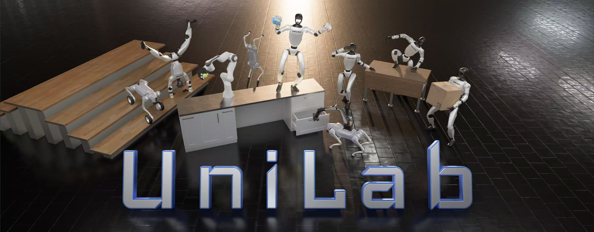

<h1 align="center"> UniLab </h1>

<h3 align="center">
面向超越 GPU 主导范式的机器人 RL 异构架构
</h3>

<p align="center">语言：简体中文 | <a href="README.md">English</a></p>

<p align="center">
  <a href="https://github.com/unilabsim/UniLab/actions/workflows/ci.yml"></a>
  <a href="https://unilabsim.github.io"></a>
  <a href="https://arxiv.org/abs/2605.30313"></a>
  <a href="https://arxiv.org/abs/2605.30313"></a>
  <a href="https://unilabsim.github.io/UniLab-doc/"></a>
  <a href="https://pypi.org/project/unilab/"></a>
  <a href="https://github.com/unilabsim/UniLab/blob/main/LICENSE"></a>
</p>

<h3 align="center">🎉 🎉 UniLab 已被 <b>CoRL 2026</b> 接收！ 🎉 🎉</h3>

<p align="center">
  
</p>

<p align="center"><em>用同一套任务编排体验覆盖运动、操作与动作跟踪。</em></p>

UniLab 是一个完整、可配置的机器人强化学习产品。使用 Hydra 描述任务，
通过 manager term 组装任务，选择物理后端，再用统一 CLI 完成训练与评估。
同一套面向任务的 contract 可以把 CPU、GPU 和外部 worker 仿真连接到学习器运行时。

物理适配器由独立的
[`unisim-core`](https://github.com/unilabsim/unisim) package 提供；RL 算法及其
runner 由 [`unilab-rl`](https://github.com/unilabsim/unilab_rl) 提供（Python
namespace 为 `uni_rl`）。UniLab 将面向用户的 task、environment、配置和实验流程
保持在一起。

如果你刚接触 UniLab，请从[第一次成功](#第一次成功运行-demo)开始；如果你已经有任务，
直接进入[训练与评估](#训练与评估)；在存在匹配 task owner 时，只需修改 `--sim` 即可尝试另一个后端。

## 亮点

```text
┌──────────────────────────────────────┐    同一套任务 contract    ┌───────────────────────────────────┐
│                                      │ ────────────────────────▶ │          按需运行任务             │
│            定义一次任务              │                           │ MuJoCo · Motrix · MJWarp · Drake  │
│       Hydra · Managers · NumPy       │                           │ Genesis · IsaacGym · IsaacSim     │
│      Terms · rewards · commands      │                           │   CUDA · ROCm · macOS · MPS · XPU │
│                                      │                           │            训练 · 评估            │
└──────────────────────────────────────┘                           └───────────────────────────────────┘
```

UniLab 的核心理念很简单：将任务语义定义为可复用的配置，然后独立更换仿真器、硬件或
learner，而无需重写任务的 environment 生命周期。

- **配置而非编码。** action、observation、reward、termination、event、command、
  curriculum 和 metrics 都是 manager term，在 Hydra owner YAML 中组装。基于已有 term
  的任务变体无需新写 environment class，很多时候完全不需要 Python 代码。
- **更换后端而不更换工作流。** 当前和未来的仿真器共用公开的 `SimBackend` contract。
  使用 `--sim` 选择后端；任务编排和训练/评估工作流保持一致，后端差异由 owner YAML
  明确表达。
- **适配手头的硬件并持续扩展。** CPU 并行仿真或外部 worker 仿真通过注入式 env contract
  和异步运行时向 accelerator learner 提供数据。算法和 runner 由统一 package 生态提供，
  不绑定单一仿真器。

## 开始使用

推荐使用 [`uv`](https://docs.astral.sh/uv/) 完成源码工作流。

```bash
curl -LsSf https://astral.sh/uv/install.sh | sh
git clone https://github.com/unilabsim/UniLab.git
cd UniLab

# 运行 Motrix demo 的最快路径。
make setup-motrix

# 完整本地环境（MuJoCo + Motrix）：
# make setup

# 可选的平台/后端路径：
# make sync-rocm       # AMD GPU
# make sync-xpu        # Intel GPU
# make setup-drake     # Drake + 原生 batch extension
```

`mujoco` extra 默认安装 `mujoco-uni-runtime` 的预编译 wheel（绑定
`mujoco==3.11.0`），无需编译器；只有切换 MuJoCo 版本
（`make mujoco MJ=<version>`，总是从源码重建原生扩展）时才需要 C++ 工具链和
Python 开发头文件。平台相关安装、可选后端和外部 worker 运行时请参阅
[安装指南](https://unilabsim.github.io/UniLab-doc/zh_CN/1-getting_started/2-installation.html)。

## 第一次成功：运行 demo

```bash
# 首次运行会从 Hugging Face 下载 checkpoint 和 asset。
uv run demo dance
```

可用预设为 `teaser`、`dance`、`wallflip`、`boxtracking`、`locomani` 和
`inhandgrasp`。运行 `uv run demo --help` 查看 device 和 refresh 选项。
[快速演示指南](https://unilabsim.github.io/UniLab-doc/zh_CN/1-getting_started/1-quick_demo.html)
介绍渲染模式以及服务器/macOS 差异。

## 训练与评估

```bash
# 使用 Motrix 训练并回放任务。
uv run train --algo ppo --task go2_joystick_flat --sim motrix
uv run eval --algo ppo --task go2_joystick_flat --sim motrix --load-run -1

# 对同一个任务只切换仿真器。
uv run train --algo ppo --task go2_joystick_flat --sim mujoco

# 或使用 off-policy learner 跑同样的工作流。
uv run train --algo sac --task g1_walk_flat --sim mujoco
uv run train --algo flashsac --task g1_walk_flat --sim mujoco

# 无头视频导出。
uv run eval --algo ppo --task go2_joystick_flat --sim motrix \
  --load-run -1 --render-mode record
```

路由选择始终清晰可见：

```text
--algo + --task + --sim  →  Hydra owner YAML  →  已注册的 environment
```

在这些 flag 之后追加普通 Hydra override：

```bash
uv run train --algo ppo --task go2_joystick_flat --sim motrix \
  algo.max_iterations=1 algo.num_envs=16 training.no_play=true
```

不要通过 override `training.sim_backend` 切换引擎；它是所选 owner YAML 提供的
identity 字段。续训、W&B、回放和完整命令矩阵请参阅
[训练指南](https://unilabsim.github.io/UniLab-doc/zh_CN/2-user_guide/1-training/0-index.html)。

## Manager-based 配置

UniLab 用 Hydra composition 和 NumPy runtime 包装了一套社区熟悉的 manager API。
任务 owner 可以用声明式配置选择 term 并设置参数：

```yaml
env:
  observations:
    policy:
      terms:
        joint_pos:
          func: unilab.envs.mdp.joint_pos_rel
        command:
          func: unilab.envs.mdp.generated_commands
          params:
            command_name: twist
  actions:
    joint_pos:
      _target_: unilab.envs.mdp.JointPositionActionCfg
      entity_name: robot
      scale: 0.25
reward:
  tracking_lin_vel:
    func: unilab.tasks.locomotion.common.manager_terms.track_lin_vel_xy_exp
    weight: 1.0
```

这意味着常见的任务修改只需改配置：组装或禁用一个 term、调整参数，并在不同机器人和
后端之间复用，无需新写 environment class。该 API 在共享 contract 范围内遵循 pinned
mjlab manager 语义，但它是结合 NumPy、Hydra 和 `NpEnvState` 语义的 UniLab 产品。
完整 contract 与已知差异请参阅
[Manager-Based API 指南](https://unilabsim.github.io/UniLab-doc/zh_CN/4-developer_guide/1-architecture/6-manager_based_api.html).

## 物理后端

当前后端通过 `unisim-core` 和同一套 UniLab 路由提供；随着新 adapter 加入，
这套 contract 可以持续扩展：

`mujoco` · `motrix` · `mjwarp` · `drake` · `genesis` · `isaacgym` · `isaacsim`

选择一条后端安装路径（需要多个后端时组合 extras）：

```bash
uv sync --extra mujoco
# uv sync --extra mujoco --extra motrix
# uv sync --extra mujoco --extra mjwarp
# uv sync --extra genesis
# make setup-drake
```

IsaacGym 和 IsaacSim 使用专用的外部 worker 环境。后端安装细节、渲染行为以及基于证据
的 task support matrix 请参阅
[后端指南](https://unilabsim.github.io/UniLab-doc/zh_CN/2-user_guide/3-backends/0-index.html)
和[支持矩阵](https://unilabsim.github.io/UniLab-doc/zh_CN/5-reference/5-support_matrix.html)。

## 生态

UniLab 被设计为机器人专属仓库共享的产品界面。目前的下游示例包括
[MicroDuck RL](https://github.com/unilabsim/microduck_rl_unilab) 和
[EngineAI RL](https://github.com/unilabsim/engineai_rl_unilab)。它们可以独立发布机器人
recipe，同时消费同一套 task、backend 和 RL contract。

## 文档

- [文档索引](https://unilabsim.github.io/UniLab-doc/zh_CN/0-index.html)
- [统一 CLI 参考](https://unilabsim.github.io/UniLab-doc/zh_CN/2-user_guide/1-training/1-cli_reference.html)
- [Task 与 manager 架构](https://unilabsim.github.io/UniLab-doc/zh_CN/4-developer_guide/1-architecture/0-index.html)
- [Sim-to-sim 部署](https://unilabsim.github.io/UniLab-doc/zh_CN/3-deployment/2-sim_to_sim/1-backend_swap.html)
- [算法扩展教程](https://unilabsim.github.io/UniLab-doc/zh_CN/4-developer_guide/3-extending/3-new_algorithm.html)
- [架构决策](https://unilabsim.github.io/UniLab-doc/adr/ADR-0000-index.html)

开发与贡献工作流请参阅[贡献指南](CONTRIBUTING.md)。

## 社区

<p align="center">
  
</p>

<p align="center">添加 UniLab 小助手微信，加入社区。</p>

## 引用

```bibtex
@article{jia2026unilab,
  title         = {UniLab: A Heterogeneous Architecture for Robot RL Beyond GPU-Dominant Paradigms},
  author        = {Jia, Yufei and Cao, Zhanxiang and Yu, Mingrui and Zhang, Heng and Chen, Shenyu and Jiang, Dixuan and Li, Meng and Li, Xiaofan and Liu, Yiyang and Wu, Junzhe and Li, Zheng and Fang, XiLin and Cui, Tingyu and Fu, Shengcheng and Li, Haoyang and Wang, Anqi and Wang, Zifan and Zhu, Dongjie and Cao, Chenyu and Huang, Zhenbiao and Zheng, Ziang and Lu, Jie and Ma, Xin and Wei, Zhengyang and Zhao, Xiang and Zhan, Tianyue and He, Ye and Chen, Yuxiang and Jiang, Yizhou and Li, Yue and Ge, Haizhou and Dong, Yuhang and Jia, Fan and Zhang, Ziheng and Zhang, Meng and Deng, Xiwa and Chen, Zhixing and Shao, Hanyang and Dong, Chenxin and Li, Yixuan and Chen, Yizhi and Chen, Bokui and Zhang, Kaifeng and Cui, Hanqing and Qin, Yusen and Huang, Ruqi and Han, Lei and Wang, Tiancai and Li, Xiang and Gao, Yue and Zhou, Guyue},
  journal       = {arXiv preprint arXiv:2605.30313},
  year          = {2026},
  url           = {https://arxiv.org/abs/2605.30313}
}
```

UniLab 以 [Apache License 2.0](LICENSE) 发布。独立的
[UniSim](https://github.com/unilabsim/unisim) 与
[UniLab RL](https://github.com/unilabsim/unilab_rl) 仓库包含各自的发布和引用信息。

## 致谢

如果没有 [Isaac Lab](https://github.com/isaac-sim/IsaacLab) 团队以及
[mjlab](https://github.com/mujocolab/mjlab) 开发团队和贡献者的出色工作，UniLab 不会
成为今天的样子。Isaac Lab 在 manager-based API 设计和抽象方面的工作，以及 mjlab
清晰、轻量的参考实现，共同塑造了 UniLab 的 Hydra + NumPy 任务编排体验。衷心感谢两个
社区分享他们的工作与想法。
